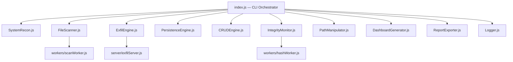

# ⚡ ASTRANETRA

> **"Astra"** (weapon) · **"Netra"** (eye) — *A watching weapon.*


An educational Node.js tool that simulates how malware operates — reconnaissance, filesystem mapping, data exfiltration, persistence, and PATH hijacking — entirely on your local machine. Built to understand virus behavior from the inside using Node.js built-ins.

> ⚠️ **No actual malicious behavior. No external network calls. No permanent damage.**
> Everything ASTRANETRA does is printed, logged, and reversible with a single command:
> `astra revert --all`

---

## Terminal Preview

```text
  ░█████╗░░██████╗████████╗██████╗░░█████╗░███╗░░██╗███████╗████████╗██████╗░░█████╗░
  ██╔══██╗██╔════╝╚══██╔══╝██╔══██╗██╔══██╗████╗░██║██╔════╝╚══██╔══╝██╔══██╗██╔══██╗
  ███████║╚█████╗░░░░██║░░░██████╔╝███████║██╔██╗██║█████╗░░░░░██║░░░██████╔╝███████║
  ██╔══██║░╚═══██╗░░░██║░░░██╔══██╗██╔══██║██║╚████║██╔══╝░░░░░██║░░░██╔══██╗██╔══██║
  ██║░░██║██████╔╝░░░██║░░░██║░░██║██║░░██║██║░╚███║███████╗░░░██║░░░██║░░██║██║░░██║
  ╚═╝░░╚═╝╚═════╝░░░╚═╝░░░╚═╝░░╚═╝╚═╝░░╚═╝╚═╝░░╚══╝╚══════╝░░░╚═╝░░░╚═╝░░╚═╝╚═╝░░╚═╝

  Astra (weapon) · Netra (eye)  —  Educational Virus Behavior Simulator
  Platform: win32 · Node: v22.11.0 · PID: 21576 · Host: LAPTOP-46D9DRON

──────────────────────────────────────────────────────────────────────────────────────
  ◉  PHASE 1 — SYSTEM RECONNAISSANCE                              12:04:10
──────────────────────────────────────────────────────────────────────────────────────

  TARGET ACQUIRED — LAPTOP-46D9DRON

  ╔══════════════════════════════════════════════════════════════════╗
  ║  OS            Windows_NT 10.0.26200                             ║
  ║  ARCH          x64                                               ║
  ║  HOSTNAME      LAPTOP-46D9DRON                                   ║
  ║  USERNAME      ash                                               ║
  ║  UPTIME        0d 4h 12m 33s                                     ║
  ║  NODE.JS       v22.11.0                                          ║
  ╚══════════════════════════════════════════════════════════════════╝

  [ CPU ]  Intel(R) Core(TM) i5-1135G7 @ 2.40GHz
  Core  0  ████████████░░░░░░░░░░░░░  48%
  Core  1  ██████░░░░░░░░░░░░░░░░░░░  24%
  Core  2  ███████████████░░░░░░░░░░  62%
  Core  3  ████░░░░░░░░░░░░░░░░░░░░░  18%

  [ RAM ]  6.1 GB used of 8 GB
  ████████████████████████████████░░░░░░░░░░░░░░░  61%

  [ DISK ]
  C:   ████████████████████████░░░░░░  68%   118 GB / 175 GB

──────────────────────────────────────────────────────────────────────────────────────
  ◈  PHASE 2 — FILESYSTEM MAPPING                                 12:04:14
──────────────────────────────────────────────────────────────────────────────────────

  Scanning |████████████████████████████████░░░░░░| 1,127,206 files | C:\Users\ash\...
  Speed: 21,400 files/sec  |  Elapsed: 52s  |  Hidden: 1,081  |  Flagged: 12

  ┌──────────────────────────────────────────────────────────────┐
  │  TOTAL FILES    1,127,206     HIDDEN FILES      1,081        │
  │  TOTAL SIZE     176.26 GB     SENSITIVE FLAGS      12        │
  │  DIRECTORIES       98,441     SCAN TIME          52.4s       │
  └──────────────────────────────────────────────────────────────┘

  ⚠  SENSITIVE FILES DETECTED (paths only — contents NOT read)
  ⚑  C:\Users\ash\.npmrc
  ⚑  C:\Users\ash\projects\.env
  ⚑  C:\Users\ash\.ssh\id_rsa

──────────────────────────────────────────────────────────────────────────────────────
  ⚠  PHASE 3 — FILE ACCESS DEMONSTRATION                          12:05:06
──────────────────────────────────────────────────────────────────────────────────────

  ╔══ READING: C:\Users\ash\astranetra\package.json
  ║  {
  ║    "name": "astranetra",
  ║    "version": "1.0.0",
  ║    ...
  ╚══ ✓ READ COMPLETE  1,204 bytes  SHA-256: e3b0c44298fc1c14...

──────────────────────────────────────────────────────────────────────────────────────
  ▶  PHASE 4 — EXFILTRATION                                       12:05:09
──────────────────────────────────────────────────────────────────────────────────────

  →  Serializing recon payload              ✓
  →  Establishing local C2 link             ✓
  →  Transmitting payload                   ✓
  →  Writing to persistent store            ✓

  ╔══════════════════════════════════════════╗
  ║  EXFIL COMPLETE                          ║
  ║  Server   http://localhost:4444          ║
  ║  DB       db/astranetra.db              ║
  ║  Payload  515,702 bytes                  ║
  ╚══════════════════════════════════════════╝

══════════════════════════════════════════════════════════════════════════════════════
  ⚡  MISSION COMPLETE — ASTRANETRA
══════════════════════════════════════════════════════════════════════════════════════
  TARGET HOST      LAPTOP-46D9DRON        FILES MAPPED    1,127,206
  OS               Windows_NT 10.0.26200  TOTAL DATA      176.26 GB
  HIDDEN FILES     1,081                  SENSITIVE        12
  DASHBOARD        dashboard.html         EXFIL VIEWER    http://localhost:4444
  UNDO ALL →       astra revert --all
```

---

## What Is This

Your professor described it in a lecture: *"Some programs copy themselves to other folders, register in PATH, and survive deletion attempts. How?"*

ASTRANETRA answers that question in working code. Every module maps to a real virus behavior. Every behavior is explained in the terminal as it executes. Every system modification is logged and reversible. This is not a theory document — it runs, it does the things, and it shows you exactly how.

Built for **Thunder Hackathon 3.0** under the theme *"Create a Virus in JS."* The goal was not to build something dangerous. It was to build something that makes the dangerous understandable.

---

## Quick Start

**Requires:** Node.js ≥ 18.0.0 · [Download](https://nodejs.org/)

### Setup
Simply run the setup script for your platform. This will install dependencies and automatically register `astra` globally.
- **Windows:** Double-click `setup.bat` (or run `.\setup.bat` in terminal)
- **Linux/Mac:** Run `bash setup.sh`

### Run It!
Now that setup is complete, you can open any terminal and run:
```bash
astra         # Command Prompt, Mac, Linux
.\astra       # Windows PowerShell
```

When done — undo every single change ASTRANETRA made:

```bash
astra revert --all
```

---

## The 5 Phases

### Phase 1 — System Reconnaissance

Uses `os` module + `child_process` to fingerprint the host.

Collects: OS name/version/arch/kernel/uptime · CPU model/cores/GHz/load per core · RAM total/used/free · all network interfaces (IPv4/IPv6/MAC/CIDR) · disk volumes (mount/total/used/free) · hostname/username/shell/home · Node.js version/V8/npm/PID · environment variables (PATH, HOME, USER, SHELL, LANG, TERM)

*Virus behavior: environment fingerprinting — mapping the target before acting.*

---

### Phase 2 — Filesystem Mapping

Spawns a `worker_threads` pool (default: 4) running `scanWorker.js` in parallel. Traverses the entire home directory without blocking the main thread.

Produces: total file + directory counts including hidden · extension frequency map · top 20 largest files · size distribution buckets · live progress bar with files/sec and ETA

Flags — **path only, contents never read:** `.env` `.pem` `.key` `id_rsa` `id_ed25519` `.p12` `credentials` `.netrc` `.npmrc` `htpasswd`

*Virus behavior: target enumeration — finding what's worth stealing.*

---

### Phase 3 — File Access Demonstration

Finds and reads real files from your system. Targets: `package.json`, `.bashrc`/`.zshrc`, `.npmrc`, system `hosts` file, any `.txt` in your home directory. Displays content in bordered terminal frames, line by line. Shows SHA-256 hash of each file after reading.

*Virus behavior: document and credential discovery — the step before exfiltration.*

---

### Phase 4 — Exfiltration

Spins up Express on `localhost:4444`. Posts the full payload — recon data, scan summary, sensitive file paths, current PATH — via HTTP POST. Simultaneously writes to SQLite via `sql.js` (pure JavaScript, zero native compilation).

Web UI at `http://localhost:4444` shows every received payload. Open it in a browser while running.

*Virus behavior: C2 data exfiltration — sending collected intelligence home.*

---

### Phase 5 — Reports + Dashboard

| Output | Format | Contents |
|---|---|---|
| `reports/report.json` | JSON | Full structured data, pretty-printed |
| `reports/report.md` | Markdown | Tables, hashes, human-readable |
| `reports/report.csv` | CSV | Per-file rows, import to Excel/Sheets |
| `dashboard.html` | HTML | Self-contained · Chart.js charts · dark aesthetic · all data embedded |

*Virus behavior: intelligence packaging — organizing collected data for use.*

---

## Demo Walkthrough

> **PowerShell Note:** If you are running these commands locally in Windows PowerShell, you must prefix them with `.\` (e.g., `.\astra persist`).

### Full Auto-Demo

```bash
astra
```

All 5 phases run with animated terminal output. Takes 1–3 minutes depending on drive size.

### Manual Demos

```bash
# Persistence — watch it register in PATH and copy to startup
astra persist
cat logs/persistence_state.json      # see exactly what changed
astra persist --revert               # undo it

# PATH hijack — a fake 'git' intercepts your command
astra path --demo

# Integrity baseline + tamper detection
astra integrity --baseline ./sandbox
echo "tampered" >> sandbox/test.txt
astra integrity --diff

# Real-time file watch
astra integrity --watch ./sandbox
```

### CRUD Demo

```bash
astra crud create sandbox/test.txt "Hello from ASTRANETRA"
astra crud read sandbox/test.txt
astra crud update sandbox/test.txt " — payload injected" --mode append
astra crud delete sandbox/test.txt --confirm
astra crud corrupt sandbox/demo.txt --demo
```

**Sample output:**

```
──────────────────────────────────────────────────────────────────────
  ✎  CRUD OPERATIONS DEMO                                14:30:15
──────────────────────────────────────────────────────────────────────

  ┌─── CREATE ───────────────────────────────────────┐
  │  ✓ Created: sandbox/demo_target.txt              │
  │  Operation: createFile()  Duration: 3ms          │
  └──────────────────────────────────────────────────┘

  ┌─── READ ─────────────────────────────────────────┐
  │  ✓ Read: sandbox/demo_target.txt                 │
  │  Content: "Hello from ASTRANETRA!"               │
  │  Operation: readFile()  Duration: 1ms            │
  └──────────────────────────────────────────────────┘

  ┌─── UPDATE ───────────────────────────────────────┐
  │  ✓ Updated: sandbox/demo_target.txt              │
  │  Mode: append  →  "...payload injected."         │
  │  Operation: updateFile(append)  Duration: 4ms    │
  └──────────────────────────────────────────────────┘

  ┌─── DELETE ───────────────────────────────────────┐
  │  ✓ Deleted: sandbox/demo_target.txt              │
  │  Moved to: .astranetra_trash/demo_target_172...  │
  │  Operation: deleteFile(trash)  Duration: 2ms     │
  └──────────────────────────────────────────────────┘

  ✓ CRUD CYCLE COMPLETE — all 4 operations in sandbox/
```

---

## Full Command Reference

> **PowerShell Note:** If you are running these commands locally in Windows PowerShell, you must prefix them with `.\` (e.g., `.\astra`).

```bash
# ── FULL PIPELINE ─────────────────────────────────────────────────────────────
astra                               # All 5 phases in sequence

# ── INDIVIDUAL PHASES ─────────────────────────────────────────────────────────
astra recon                         # System fingerprinting only
astra scan                          # Filesystem scan incl. hidden files
astra exfil                         # POST to localhost:4444 + SQLite
astra exfil --server-only           # Start server and keep alive
astra exfil --db-only               # SQLite only, skip server

# ── PERSISTENCE ───────────────────────────────────────────────────────────────
astra persist                       # Self-copy to startup + PATH entry
astra persist --revert              # Undo all persistence changes

# ── PATH ──────────────────────────────────────────────────────────────────────
astra path                          # Analyze PATH, flag suspicious entries
astra path --demo                   # Session-scoped PATH hijack (fake git)
astra path --inject <dir>           # Permanently add dir to PATH
astra path --revert                 # Remove all injected entries

# ── INTEGRITY ─────────────────────────────────────────────────────────────────
astra integrity --baseline          # SHA-256 snapshot of current directory
astra integrity --baseline /dir     # Snapshot a specific directory
astra integrity --diff              # Diff the latest two snapshots
astra integrity --watch             # Real-time change detection
astra integrity --watch /dir        # Watch a specific directory

# ── CRUD ──────────────────────────────────────────────────────────────────────
astra crud create <path> "content"
astra crud create <path> "content" --force      # Overwrite if exists
astra crud read <path>
astra crud update <path> "content"              # Default: overwrite
astra crud update <path> "content" --mode append
astra crud update <path> "content" --mode prepend
astra crud delete <path> --confirm
astra crud delete <path> --permanent --confirm  # Hard delete, skips trash
astra crud corrupt sandbox/test.txt --demo      # Replace with random bytes
astra crud corrupt <path> --demo --force        # Override sandbox limit
astra crud move <src> <dest>

# ── DATABASE ──────────────────────────────────────────────────────────────────
astra db --list                     # Show all stored scans
astra db --clear                    # Wipe all stored data

# ── OUTPUT ────────────────────────────────────────────────────────────────────
astra dashboard                     # Regenerate dashboard.html
astra report --format json
astra report --format md
astra report --format csv

# ── NUCLEAR OPTION ────────────────────────────────────────────────────────────
astra revert --all                  # Undo EVERYTHING ASTRANETRA ever did

# ── HELP ──────────────────────────────────────────────────────────────────────
astra --help
```

---

## Architecture



**Data flow:**

```
index.js
  ├── SystemRecon.js        →  recon data object
  ├── FileScanner.js
  │     └── scanWorker.js   →  file stats, extension map, sensitive flags
  ├── ExfilEngine.js
  │     ├── exfilServer.js  →  localhost:4444 (live web UI)
  │     └── sql.js          →  db/astranetra.db
  ├── PersistenceEngine.js  →  startup folder entry + shell config PATH line
  │     └── persistence_state.json  (tracks every change for exact revert)
  ├── PathManipulator.js    →  injected_demo/ (session-scoped only)
  ├── CRUDEngine.js         →  sandbox/ + .astranetra_trash/
  ├── IntegrityMonitor.js
  │     └── hashWorker.js   →  snapshots/<timestamp>.snapshot.json
  ├── DashboardGenerator.js →  dashboard.html
  ├── ReportExporter.js     →  reports/report.json + .md + .csv
  └── Logger.js             →  logs/ (6 structured log files)
```

---

## Module Reference

| Module | What it does | Key technical decision |
|---|---|---|
| `core/SystemRecon.js` | OS, CPU, RAM, network, disk, env var collection | PowerShell `Get-PSDrive` on Windows 11 (wmic removed in 24H2); `df -k` on Linux/macOS |
| `core/FileScanner.js` | Recursive async scan with live progress bar | `worker_threads` pool — main thread never blocks; progress updates every 50 files |
| `core/CRUDEngine.js` | Create, read, update, delete, corrupt, move | Atomic writes via `.tmp`-then-`rename`; delete goes to trash before any hard delete |
| `core/PersistenceEngine.js` | Self-copy to startup + PATH registration | All changes saved to `persistence_state.json`; `--revert` undoes exactly those changes |
| `core/ExfilEngine.js` | POST to local server + SQLite write | Pure `http` module (no axios); `sql.js` for pure-JS SQLite with zero native compilation |
| `core/IntegrityMonitor.js` | SHA-256 snapshots + diff engine + watch mode | Files streamed through `crypto.createHash` — never loaded fully into memory |
| `core/PathManipulator.js` | Analyze, hijack-demo, inject, revert PATH | Demo is session-scoped only; permanent entries marked `# astranetra` for clean revert |
| `server/exfilServer.js` | Express C2 receiver on localhost:4444 | Web UI auto-refreshes every 5s; full payload history at `/payloads` endpoint |
| `workers/scanWorker.js` | Parallel directory traversal | Runs in worker thread; sends file events via `parentPort.postMessage` |
| `workers/hashWorker.js` | Parallel SHA-256 file hashing | Streams files through hash transform; never loads full file into memory |
| `output/Logger.js` | Structured logging to 6 targets | Singleton; supports live listeners for terminal feed |
| `output/DashboardGenerator.js` | Self-contained HTML dashboard | All data in `window.__ASTRANETRA_DATA__`; Chart.js via CDN; zero server needed |
| `output/ReportExporter.js` | JSON / Markdown / CSV export | All three formats from the same internal data model |

---

## Project Structure

```
astranetra/
├── index.js                      ← CLI entry point + terminal orchestrator
├── package.json
├── config/
│   └── astranetra.config.js      ← all tunable parameters, cross-platform paths
├── core/
│   ├── SystemRecon.js            ← OS, CPU, RAM, network, env var collection
│   ├── FileScanner.js            ← recursive async scan, worker_threads pool
│   ├── CRUDEngine.js             ← create/read/update/delete/corrupt/move
│   ├── PersistenceEngine.js      ← self-copy to startup + PATH registration
│   ├── ExfilEngine.js            ← POST to local server + SQLite write
│   ├── IntegrityMonitor.js       ← SHA-256 snapshots + diff + chokidar watch
│   └── PathManipulator.js        ← PATH read/analyze/demo/inject/revert
├── server/
│   └── exfilServer.js            ← Express server on localhost:4444
├── output/
│   ├── Logger.js                 ← structured JSON + pretty logs, 6 targets
│   ├── DashboardGenerator.js     ← self-contained dark HTML dashboard
│   └── ReportExporter.js         ← JSON / Markdown / CSV writer
├── workers/
│   ├── scanWorker.js             ← parallel directory traversal thread
│   └── hashWorker.js             ← parallel SHA-256 computation thread
├── db/                           ← auto-created · astranetra.db lives here
├── logs/                         ← auto-created · 6 structured log files
├── snapshots/                    ← auto-created · integrity baseline snapshots
├── reports/                      ← auto-created · report.json / .md / .csv
├── sandbox/                      ← safe zone for CRUD demos
└── .astranetra_trash/            ← deleted files park here before hard delete
```

---

## Output Files

Everything generated at runtime — open these after running:

```
dashboard.html                    ← open in browser first
reports/report.json               ← full data, pretty-printed
reports/report.md                 ← human-readable with tables
reports/report.csv                ← importable into Excel / Sheets
db/astranetra.db                  ← SQLite, queryable with: astra db --list
logs/astranetra.log.json          ← all events, machine-readable
logs/astranetra.log.txt           ← human-readable with timestamps
logs/crud.log.json                ← CRUD operations only
logs/persistence.log.json         ← every persistence action + revert
logs/exfil.log.json               ← every POST and DB write
logs/integrity.log.json           ← hash operations and file changes
snapshots/<timestamp>.json        ← SHA-256 baseline for integrity diff
```

**What to open first:** `dashboard.html` for visuals. `http://localhost:4444` while the server is running. `logs/persistence_state.json` to see what was changed and confirm revert worked.

---

## Virus Behavior Mapping

Every feature maps to a documented malware technique:

| ASTRANETRA Feature | Real Malware Behavior | Node.js Mechanism |
|---|---|---|
| `recon` | Environment fingerprinting | `os`, `child_process` |
| `scan` (incl. hidden files) | Target enumeration | `fs.readdir`, `worker_threads` |
| Phase 3 file reads | Document + credential discovery | `fs.readFileSync`, `crypto` |
| `exfil` → local server | C2 data exfiltration | `http`, `express` |
| `exfil` → SQLite | Persistent intelligence storage | `sql.js` |
| `persist` (startup copy) | Survives reboots | `fs`, `child_process` |
| `persist` (PATH entry) | Command hijacking setup | shell configs / `setx` |
| `path --demo` | PATH hijacking attack | `child_process`, `process.env` |
| `crud corrupt` | Ransomware / data destruction | `fs`, `crypto.randomBytes` |
| `integrity --watch` | Tamper detection / evasion awareness | `crypto`, `chokidar` |
| `revert --all` | Evidence removal on exit | All of the above |

---

## Platform Support

| Feature | Windows | Linux | macOS |
|---|---|---|---|
| System Recon | ✅ | ✅ | ✅ |
| Disk Info Method | ✅ PowerShell `Get-PSDrive` | ✅ `df -k` | ✅ `df -k` |
| File Scan | ✅ | ✅ | ✅ |
| Hidden Files | ✅ dot-prefix heuristic | ✅ dot-prefix | ✅ dot-prefix |
| Exfil Server + DB | ✅ | ✅ | ✅ |
| Persist — startup | ✅ `%APPDATA%\...\Startup\` | ✅ `~/.config/autostart/` | ✅ `~/Library/LaunchAgents/` |
| Persist — PATH | ✅ `setx` | ✅ `.bashrc` + `.zshrc` | ✅ `.zshrc` + `.bash_profile` |
| PATH Hijack Demo | ✅ `.cmd` fake script | ✅ `sh` fake script | ✅ `sh` fake script |
| Integrity Monitor | ✅ | ✅ | ✅ |
| Dashboard | ✅ | ✅ | ✅ |

> **Windows 11 note:** `wmic` was removed in Windows 11 24H2.
> ASTRANETRA uses PowerShell `Get-PSDrive` for disk info — tested on all Windows versions.

---

## Configuration

Key parameters in `config/astranetra.config.js`:

```javascript
scan: {
  roots: { win32: ['C:\\'], linux: [home], darwin: [home] },
  excludePaths: ['/proc', '/sys', '/dev', 'node_modules', '.git'],
  workerCount: 4,                 // increase on fast SSDs
  sensitivePatterns: [
    '.env', '.pem', '.key', 'id_rsa', 'id_ed25519',
    '.p12', 'credentials', '.netrc', '.npmrc', 'htpasswd',
  ],
},
exfil: {
  serverPort: 4444,               // change if port is in use
  dbPath: './db/astranetra.db',
},
persistence: {
  revertOnExit: false,            // set true to auto-revert on process exit
},
crud: {
  sandboxDir: './sandbox',        // corruptFile only works here without --force
  requireConfirmForDelete: true,
  atomicWrites: true,
},
```

---

## Code Flow & Strategy

The pipeline is orchestrated by `index.js`. Each phase calls a dedicated module:

1. **Reconnaissance** (`SystemRecon.js`) — `os` module + `child_process`. Platform-specific disk query: PowerShell on Windows, `df` on Linux/macOS. Every missing value falls back to `'unknown'` instead of crashing.

2. **Scanning** (`FileScanner.js` + `scanWorker.js`) — `worker_threads` pool keeps the main event loop free. Workers send file events back via `parentPort.postMessage`. Sensitive patterns are flagged by path match — files are never opened.

3. **Exfiltration** (`ExfilEngine.js` + `exfilServer.js`) — Pure `http` module POST. `sql.js` for SQLite (pure JavaScript WebAssembly — zero `node-gyp`, zero build tools, works on any OS after `npm install`).

4. **Persistence** (`PersistenceEngine.js`) — OS-specific startup targets per `process.platform`. Every write is recorded in `logs/persistence_state.json`. `--revert` reads that file and undoes exactly those entries — nothing is guessed.

5. **Reporting** (`DashboardGenerator.js` + `ReportExporter.js`) — All three report formats from the same internal data model. Dashboard is fully self-contained: data embedded as `window.__ASTRANETRA_DATA__`, Chart.js via CDN.

**Why `sql.js` over `better-sqlite3`:** `better-sqlite3` needs `node-gyp` and platform build tools (Visual Studio / Xcode). `sql.js` compiles SQLite to WebAssembly — pure JavaScript, installs in seconds, works everywhere.

**Why `worker_threads` for scanning:** 1M+ files = 1M+ filesystem calls. Doing this on the main thread blocks the terminal UI. Workers run the I/O in parallel, the main thread just receives events and updates the progress bar.

---

## Error Handling

- **Version check** — Node.js version verified before any module loads
- **Timeouts** — all `child_process` calls use 3–8 second timeouts to prevent hangs
- **Graceful degradation** — inaccessible paths logged and skipped, never thrown; missing env vars fall back to `'unknown'`
- **SIGINT / SIGTERM** — handlers flush all log streams and stop the exfil server cleanly
- **Sandbox enforcement** — `corruptFile` only operates inside `sandbox/`; `--force` required to override
- **Atomic writes** — write-to-`.tmp`-then-`fs.rename` prevents corruption on interrupted writes
- **Port conflict** — if `localhost:4444` is taken, server start is skipped with a warning; DB write still succeeds

---

## Known Limitations

- **Windows PATH length** — `setx` has a 1024-character limit. If your PATH exceeds it, PATH injection is skipped and a warning is logged. Everything else runs normally.
- **Windows hidden files** — Detection uses dot-prefix heuristic. `FILE_ATTRIBUTE_HIDDEN` (right-click → Properties → Hidden) is not checked via the Windows API.
- **Large drives** — Scanning 500K+ files takes several minutes. Expected behavior. The progress bar shows accurate ETA.
- **Dashboard offline** — Chart.js loads from CDN. Page renders but charts stay blank without internet.
- **Docker / CI** — Some recon values (`username`, `shell`) may show as `'unknown'` in containers where `/etc/passwd` is minimal.

---

## Tech Stack

**npm dependencies:**

| Package | Version | Purpose |
|---|---|---|
| `express` | ^4.18.2 | Local C2 receiver server |
| `sql.js` | ^1.11.0 | Pure-JS SQLite — zero native compilation, works everywhere |
| `chokidar` | ^3.5.3 | Real-time filesystem watching |
| `cli-progress` | ^3.12.0 | Animated scan progress bars |
| `chalk` | ^5.3.0 | Terminal colors |
| `ora` | ^8.0.1 | Terminal spinners |
| `blessed` | ^0.1.81 | Terminal UI panels |
| `blessed-contrib` | ^4.11.0 | Terminal dashboard widgets |
| `systeminformation` | ^5.21.22 | Deep hardware metrics fallback |
| `open` | ^10.0.3 | Cross-platform file/URL opener |

**Node.js built-ins — no install needed:**
`fs` · `os` · `crypto` · `child_process` · `path` · `http` · `worker_threads` · `readline` · `url`

---

## Non-Goals

✅ **What ASTRANETRA is:**
- A local educational simulation — nothing leaves your machine
- Fully transparent — every action is printed to the terminal as it happens
- Completely reversible — `astra revert --all` undoes everything
- Working cross-platform code that demonstrates real OS behaviors

❌ **What ASTRANETRA is not:**
- No external network calls — exfil target is always `localhost`
- No reading of flagged sensitive file contents — paths only, files never opened
- No process injection, memory manipulation, keylogging, or screen capture
- No permanent damage — every system change has a documented revert path
- No exploitation of any vulnerability

---

## License

MIT — Educational use only.

---

*ASTRANETRA is an educational tool. It operates entirely on your local machine.*
*The eye watches only what you show it.*

**Built for Thunder Hackathon 3.0** · *Create a Virus in JS*