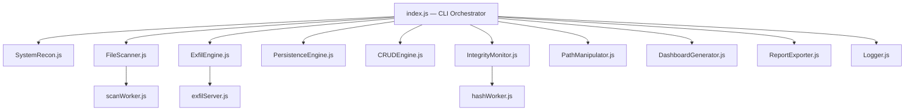

# ⚡ ASTRANETRA

> **"Astra"** (weapon) · **"Netra"** (eye) — *A watching weapon.*


An educational JavaScript tool that simulates how malware operates — reconnaissance, persistence, filesystem control, and data exfiltration — entirely on your local machine. Built to understand virus behavior from the inside, using Node.js built-ins.

**⚠️ No actual malicious behavior. No remote transmission. No damage. Everything is reversible.**

---

## Prerequisites

- **Node.js ≥ 18.0.0** — [Download here](https://nodejs.org/)
- **npm** (bundled with Node.js)

Verify your installation:
```bash
node --version   # Should print v18.x.x or higher
npm --version
```

---

## Setup

```bash
# 1. Clone / extract the project
cd astranetra

# 2. Install dependencies
npm install

# 3. Run
node index.js --help
```

---

## Quick Start

```bash
# Full pipeline — recon + scan + CRUD demo + exfil + dashboard
node index.js

# Individual commands
node index.js recon                        # System info
node index.js scan                         # File scan (includes hidden files)
node index.js exfil                        # Send data to localhost:4444 + SQLite
node index.js persist                      # Self-copy + PATH registration
node index.js path --demo                  # PATH hijack demo
node index.js integrity --baseline         # SHA-256 snapshot
node index.js crud corrupt sandbox/test.txt --demo   # File corruption demo
node index.js dashboard                    # Regenerate dashboard.html

# Undo everything
node index.js revert --all
```

---

## Demo Walkthrough (for Judges)

### Full Auto-Demo (Recommended)
```bash
node index.js
```
This runs all phases automatically:
1. System Reconnaissance
2. Filesystem Mapping
3. File Access Demonstration
4. **CRUD Operations Demo** (Create → Read → Update → Delete)
5. Exfiltration to localhost
6. Report & Dashboard Generation

### Manual CRUD Demo
```bash
node index.js crud create sandbox/test.txt "Hello World"
node index.js crud read sandbox/test.txt
node index.js crud update sandbox/test.txt "Modified!" --mode=append
node index.js crud delete sandbox/test.txt
node index.js crud corrupt sandbox/demo.txt --demo
```

### Sample Output (CRUD Phase)
```
──────────────────────────────────────────────────────────────────────
  ✎  PHASE 3.5 — CRUD OPERATIONS DEMO                    14:30:15
──────────────────────────────────────────────────────────────────────

  Demonstrating file manipulation inside sandbox/ — all reversible

  ┌─── CREATE ───────────────────────────────────────┐
  │  ✓ Created: sandbox/demo_target.txt
  │  Operation: createFile()  Duration: 3ms
  └──────────────────────────────────────────────────┘

  ┌─── READ ─────────────────────────────────────────┐
  │  ✓ Read: sandbox/demo_target.txt
  │  Content: "Hello from ASTRANETRA! Original content."
  │  Operation: readFile()  Duration: 1ms
  └──────────────────────────────────────────────────┘

  ┌─── UPDATE ───────────────────────────────────────┐
  │  ✓ Updated: sandbox/demo_target.txt
  │  Content now: "Hello from ASTRANETRA!... Payload injected."
  │  Operation: updateFile(append)  Duration: 4ms
  └──────────────────────────────────────────────────┘

  ┌─── DELETE ───────────────────────────────────────┐
  │  ✓ Deleted: sandbox/demo_target.txt
  │  Moved to trash: .astranetra_trash/demo_target.txt_1719923415
  │  Operation: deleteFile(trash)  Duration: 2ms
  └──────────────────────────────────────────────────┘

  ✓ CRUD CYCLE COMPLETE  All 4 operations demonstrated safely in sandbox/
```

---

## What Each Feature Demonstrates

| Feature | Virus Behavior It Simulates | Node.js Built-in |
|---|---|---|
| `recon` | Environment fingerprinting | `os`, `child_process` |
| `scan` (hidden files) | Target enumeration | `fs.readdir`, `worker_threads` |
| `exfil` → localhost server | C2 data exfiltration | `http`, `express` |
| `exfil` → SQLite | Persistent data storage | `sql.js` |
| `persist` (startup copy) | Survives reboots | `fs`, `child_process` |
| `persist` (PATH entry) | Command hijacking setup | Shell configs / `setx` |
| `path --demo` | PATH hijacking | `child_process`, `process.env` |
| `crud corrupt` | File destruction / ransomware | `fs`, `crypto` |
| `integrity` | Detecting modifications | `crypto`, `chokidar` |
| `revert --all` | Evidence removal / clean exit | All of the above |

---

## Architecture



---

## Code Flow

The execution follows a strict pipeline, orchestrated by the central CLI (`index.js`). Depending on the flags passed, the system runs through the following phases:

1. **Reconnaissance (`core/SystemRecon.js`):** Queries the OS using Node's built-in `os` and `child_process` modules to capture hostname, CPU architecture, environment variables, Node.js version, platform info, and user home directory. Handles missing values securely using safe fallbacks and `try/catch` blocks.
2. **Scanning (`core/FileScanner.js` & `workers/scanWorker.js`):** Offloads deep filesystem traversal to background worker threads to avoid blocking the main event loop, identifying sensitive files based on configurable patterns.
3. **Data Exfiltration (`core/ExfilEngine.js` & `server/exfilServer.js`):** Serializes the gathered intelligence (system info and file paths) into a structured JSON payload. Sends it via HTTP POST to a local Express server, which saves the payload securely into an SQLite database (`sql.js`).
4. **File Operations (`core/CRUDEngine.js`):** Enables direct CRUD operations (read, append, corrupt, rename) on files within the sandbox to demonstrate payload execution safely.
5. **Persistence (`core/PersistenceEngine.js` & `core/PathManipulator.js`):** Demonstrates self-replication by copying the payload into OS-specific startup folders and modifying the PATH variable to hijack future commands.
6. **Reporting (`output/DashboardGenerator.js`):** Formats and outputs the collected data either via beautifully rendered CLI components or by generating an interactive HTML dashboard.

---

## Strategy

The strategy behind Astranetra relies heavily on **safe local simulation** combined with **highly efficient concurrency**.

*   **Concurrency for Performance:** A key aspect of our strategy is using Node.js `worker_threads` for CPU-intensive tasks like hashing (`hashWorker.js`) and I/O-intensive tasks like deep directory scanning (`scanWorker.js`). This ensures that the main thread (and thus the terminal UI) remains perfectly responsive.
*   **Zero-Damage Educational Approach:** The strategy strictly confines file manipulation (CRUD) to the `sandbox/` directory. Reconnaissance is strictly read-only, and exfiltration targets a local `localhost:4444` server rather than an external IP address, ensuring 100% safety.
*   **Cross-Platform Adaptability:** Instead of hardcoding OS behaviors, the reconnaissance and persistence engines dynamically detect the platform (`win32`, `linux`, `darwin`) and execute the correct specific strategy (e.g., modifying `~/.bashrc` on Linux vs `setx PATH` on Windows).
*   **Graceful Degradation:** All system calls and shell commands are wrapped in strict timeouts and try/catch blocks. If a value (like an environment variable or disk mount) is missing or inaccessible, the code logs the failure internally and falls back to safe defaults without crashing the tool.

---

## Project Structure

```
astranetra/
├── core/
│   ├── SystemRecon.js        OS, CPU, RAM, network, env vars
│   ├── FileScanner.js        Recursive scan — visible + hidden files
│   ├── CRUDEngine.js         Safe, logged file operations
│   ├── PersistenceEngine.js  Self-copy + PATH registration
│   ├── ExfilEngine.js        POST to local server + SQLite
│   ├── IntegrityMonitor.js   SHA-256 snapshots + diff
│   ├── PathManipulator.js    PATH read / demo / inject / revert
│   └── utils.js              Shared utility functions
├── server/
│   └── exfilServer.js        Local Express server (localhost:4444)
├── output/
│   ├── Logger.js             Structured logging, all targets
│   ├── DashboardGenerator.js Self-contained HTML dashboard
│   └── ReportExporter.js     JSON / Markdown / CSV
├── workers/
│   ├── scanWorker.js         Parallel directory traversal
│   └── hashWorker.js         Parallel SHA-256 hashing
├── config/
│   └── astranetra.config.js  All tunable parameters
├── sandbox/                  Safe zone for CRUD demos
├── index.js                  CLI orchestrator — one script
└── package.json
```

---

## How Errors Are Handled

- **Startup validation:** Node.js version is checked before any module loads. Missing `node_modules` triggers a friendly error.
- **Timeouts:** All `child_process` calls (`execSync`) use 3–8 second timeouts to prevent hangs.
- **Graceful degradation:** Missing environment variables, inaccessible directories, and unavailable APIs fall back to safe defaults (`'unknown'`, `'N/A'`) instead of crashing.
- **SIGINT/SIGTERM:** Graceful shutdown handlers flush logs and stop the exfil server.
- **Sandbox enforcement:** CRUD operations are confined to `sandbox/` by default; `--force` is required to operate outside.
- **Atomic writes:** File updates use write-to-temp-then-rename to prevent corruption.

---

## Platform Support

| Feature | Windows | Linux | macOS |
|---|---|---|---|
| System Recon | ✅ | ✅ | ✅ |
| File Scan | ✅ | ✅ | ✅ |
| Hidden Files | ✅ | ✅ | ✅ |
| Exfil Server + DB | ✅ | ✅ | ✅ |
| Persist (startup) | ✅ Startup folder | ✅ `.desktop` autostart | ✅ LaunchAgent `.plist` |
| Persist (PATH) | ✅ `setx` | ✅ `.bashrc` / `.zshrc` | ✅ `.zshrc` / `.bash_profile` |
| PATH Hijack Demo | ✅ | ✅ | ✅ |
| Integrity Monitor | ✅ | ✅ | ✅ |
| Dashboard | ✅ | ✅ | ✅ |

---

## Known Limitations

- **Windows PATH length:** `setx PATH` has a 1024-character limit. If the user's PATH exceeds this, the tool skips PATH injection and logs a warning.
- **Windows hidden files:** Hidden file detection uses dot-prefix heuristic. True Windows `FILE_ATTRIBUTE_HIDDEN` is not checked.
- **Large drives:** Scanning the entire home directory on machines with 500K+ files may take several minutes.
- **Dashboard offline:** The HTML dashboard loads Chart.js from a CDN. Offline viewing works but charts will not render.
- **Docker/CI:** Some recon values (e.g., username) may show as `'unknown'` in containerized environments where `/etc/passwd` is incomplete.

---

## Non-Goals

- ❌ No external network calls — exfil is `localhost` only
- ❌ No reading of sensitive file contents — paths are flagged, files are never opened
- ❌ No process injection, keylogging, or screen capture
- ❌ No permanent damage — every change has a documented revert

---

## License

MIT License — Educational use only.

---

*ASTRANETRA is an educational tool. It operates entirely on your local machine. The eye watches only what you show it.*
